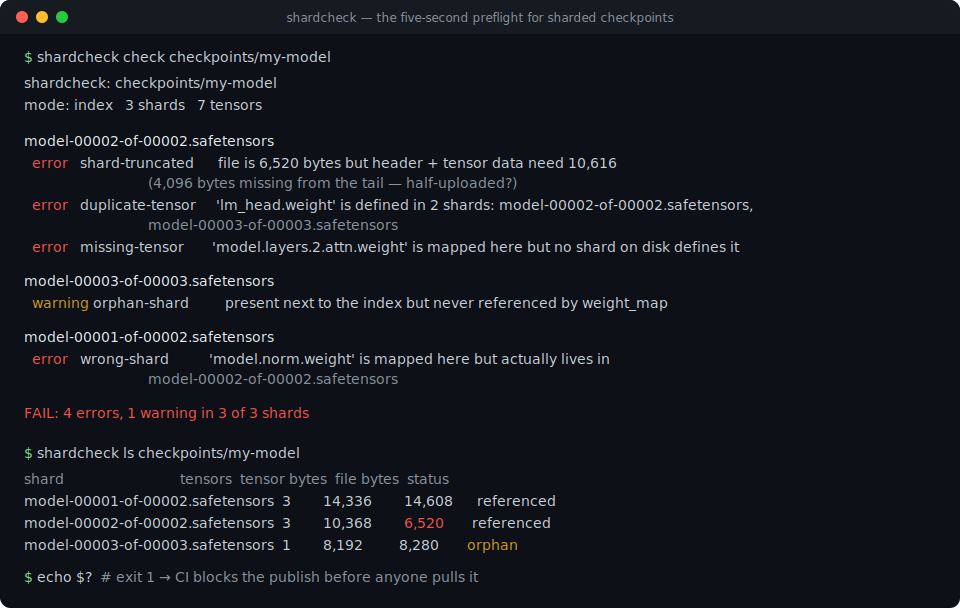
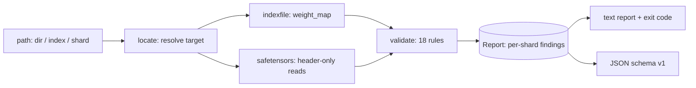

# shardcheck

[English](README.md) | [中文](README.zh.md) | [日本語](README.ja.md)

[](LICENSE) [](CHANGELOG.md) [](pyproject.toml)  [](CONTRIBUTING.md)

**シャード分割チェックポイントのインデックスを事前検証するオープンソースツール — safetensors シャード間の欠損・重複・切り詰め・オフセット重複テンソルを、ロード開始から数分後ではなく数秒で検出。**



```bash
git clone https://github.com/JaydenCJ/shardcheck && cd shardcheck && pip install -e .
```

> **プレリリース：** shardcheck はまだ PyPI に公開されていません。初回リリースまでは [JaydenCJ/shardcheck](https://github.com/JaydenCJ/shardcheck) をクローンし、リポジトリのルートで `pip install -e .` を実行してください。

## なぜ shardcheck？

シャード分割チェックポイントは、1 つの `model.safetensors.index.json` と数十のシャードファイルの間の契約です — そしてロード時までその契約を検証するものは何もありません。途中で切れたアップロード、再シャード後に残った古いインデックス、以前の保存の残骸ファイル：どれも数分間は正常にロードが進み、その後 GPU マシン上で、重みを全部取得し終えた後に、ローダーの奥深くで `KeyError` やサイズ assertion で死にます。`transformers` はロードを実際に試みることでしか破損を発見できず、`safetensors` ライブラリは開いた 1 ファイルしか検証せずインデックスを知りません。shardcheck はヘッダーだけ — シャードあたり数 KB、テンソルデータは一切読まない — で契約全体を 1 秒未満でクロスチェックし、シャード単位の結果と CI にそのまま組み込める安定したルール id を出力します。

|  | shardcheck | transformers ロード | safetensors（open） | 手書きスクリプト |
|---|---|---|---|---|
| エラーが表面化するタイミング | 何かをロードする前 | 数分後、ロード時 | ファイル単位、open 時 | 最後に更新された時期次第 |
| インデックス ↔ シャードのクロスチェック（欠損 / 誤シャード / 重複 / 未マップ） | あり | 部分的、遅いクラッシュとして | なし | まれ |
| 半アップロードのシャードを、欠損バイト数つきで検出 | あり | クラッシュのみ、バイト数なし | あり、ただし 1 ファイルずつ | 通常ファイルサイズ比較のみ |
| シャード単位レポート + 安定ルール id + CI 終了コード | あり | なし（例外 1 つだけ） | なし | 場当たり的 |
| テンソルデータを読むか | 一切読まない — ヘッダーのみ | すべて読む | open 時に mmap | 場合による |
| ランタイム依存 | 0 | torch + 依存ツリー一式 | ネイティブ wheel 1 つ | 時間とともに増える |

<sub>各行の記述は 2026-07 時点の transformers 4.x `from_pretrained` と safetensors 0.4–0.5 `safe_open` の挙動に基づきます。shardcheck の依存数は [pyproject.toml](pyproject.toml) の `dependencies = []` です。</sub>

## 特長

- **5 秒のプリフライト** — シャードあたり `8 + header_size` バイトしか読まないため、100 GB のチェックポイントも 1 秒未満で検査完了；アップロード・ダウンロード・再シャードのたびに実行できます。
- **半アップロード検出器** — `shard-truncated` がファイルサイズとヘッダーの約束を突き合わせ、末尾から何バイト欠けているかを正確に報告します。
- **古いインデックスの追跡調査** — 孤児シャードも解析対象：インデックスがシャード A にマップしたテンソルが実際は未参照のシャード B にある場合、曖昧な「欠損」ではなく B を指す `wrong-shard` として報告されます。
- **18 ルール、安定 id** — 3 つの層（インデックスのクロスチェック、シャードコンテナ、ペイロードレイアウト）を [`docs/rules.md`](docs/rules.md) と `shardcheck explain` で文書化；id の意味は決して変わりません。
- **ノイズなしのシグナル** — 欠損シャードは 1 件の報告であり、マップされたテンソルごとに 1 件ではありません；合計サイズは完全に計算できる場合のみ比較；長さゼロのテンソルはレイアウトルールを発火させません。
- **CI ネイティブ** — 終了コード 0/1/2、警告も失敗にする `--strict`、バージョン付きスキーマの `--json`、さらにあらゆる JSON パーサーが黙って飲み込むヘッダー内キー重複のバイトレベル検出。

## クイックスタート

インストール：

```bash
git clone https://github.com/JaydenCJ/shardcheck && cd shardcheck && pip install -e .
```

チェックポイントディレクトリ、`*.index.json`、または単一シャードを指定します：

```bash
shardcheck check checkpoints/my-model
```

実際にキャプチャした出力（半アップロードのシャードと古いインデックスを持つチェックポイント；`examples/make_fixture.py` で構築）：

```text
shardcheck: checkpoints/my-model
mode: index   3 shards   7 tensors

model-00002-of-00002.safetensors
  error   shard-truncated      file is 6,520 bytes but header + tensor data need 10,616 (4,096 bytes missing from the tail — half-uploaded?)
  error   duplicate-tensor     'lm_head.weight' is defined in 2 shards: model-00002-of-00002.safetensors, model-00003-of-00003.safetensors
  error   missing-tensor       'model.layers.2.attn.weight' is mapped here but no shard on disk defines it

model-00003-of-00003.safetensors
  warning orphan-shard         present next to the index but never referenced by weight_map

model-00001-of-00002.safetensors
  error   wrong-shard          'model.norm.weight' is mapped here but actually lives in model-00002-of-00002.safetensors

FAIL: 4 errors, 1 warning in 3 of 3 shards
```

終了コードは 1 なので、公開パイプラインはここで止まります。健全なチェックポイントは 0 で終了し、判定は 1 行だけです：

```text
OK: 2 shards, 6 tensors, no findings
```

シャードごとのサイズを確認（切り詰められたファイルと孤児シャードに注目）：

```bash
shardcheck ls checkpoints/my-model
```

```text
shard                             tensors  tensor bytes  file bytes  status
model-00001-of-00002.safetensors  3        14,336        14,608      referenced
model-00002-of-00002.safetensors  3        10,368        6,520       referenced
model-00003-of-00003.safetensors  1        8,192         8,280       orphan
```

同じ検査は Python からも import 1 つで使えます：

```python
from shardcheck import validate

report = validate("checkpoints/my-model")
assert report.ok, [f.rule for f in report.findings]
```

## コマンドと終了コード

| コマンド | 内容 | 終了コード |
|---|---|---|
| `shardcheck check PATH [--json] [--strict] [-v]` | インデックスファイル・シャード・ディレクトリに全 18 ルールを実行 | 0 ロード可能 / 1 検出あり / 2 対象が不正 |
| `shardcheck ls PATH [--json]` | シャードごとに 1 行：テンソル数、宣言バイト数、ファイルバイト数、状態 | 0 / 2 |
| `shardcheck explain [RULE]` | ルールカタログ、または 1 ルールの完全なドキュメント | 0 / 2 |

完全なルールリファレンス — 全 18 id、重大度、発火条件、JSON スキーマ — は [`docs/rules.md`](docs/rules.md) にあります。

## 検証

このリポジトリは CI を持ちません；上記の主張はすべてローカル実行で検証されています。このリポジトリのチェックアウトから再現できます：

```bash
pip install -e '.[dev]' && pytest && bash scripts/smoke.sh
```

出力（実際の実行からコピー、`...` で省略）：

```text
90 passed in 0.27s
...
[ls] model-00003-of-00003.safetensors  1        8,192         8,280       orphan
SMOKE OK
```

## アーキテクチャ



## ロードマップ

- [x] ヘッダーのみのパーサー、18 ルールのバリデーター、シャード単位レポート、`check`/`ls`/`explain`、JSON スキーマ、Python API（v0.1.0）
- [ ] PyPI 公開（`pip install shardcheck`）
- [ ] `--fix` モード：ディスク上のシャードから正しいインデックスを再生成
- [ ] オプションの深層検証：lockfile に対してテンソルペイロードをハッシュ照合
- [ ] 混在フォーマットリポジトリ向けの GGUF / PyTorch-bin インデックス対応

完全なリストは [open issues](https://github.com/JaydenCJ/shardcheck/issues) を参照してください。

## コントリビュート

コントリビュート歓迎です — [good first issue](https://github.com/JaydenCJ/shardcheck/issues?q=is%3Aissue+is%3Aopen+label%3A%22good+first+issue%22) から始めるか、[discussion](https://github.com/JaydenCJ/shardcheck/discussions) を立ててください。開発環境の構築は [CONTRIBUTING.md](CONTRIBUTING.md) を参照。

## ライセンス

[MIT](LICENSE)
