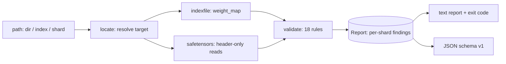

# shardcheck

[English](README.md) | [中文](README.zh.md) | [日本語](README.ja.md)

[](LICENSE) [](CHANGELOG.md) [](pyproject.toml)  [](CONTRIBUTING.md)

**Open-source preflight validation for sharded checkpoint indexes — missing, duplicated, truncated or overlapping tensors across safetensors shards, caught in seconds instead of minutes into a load.**


```bash
git clone https://github.com/JaydenCJ/shardcheck && cd shardcheck && pip install -e .
```

> **Pre-release:** shardcheck is not yet published to PyPI. Until the first release, clone [JaydenCJ/shardcheck](https://github.com/JaydenCJ/shardcheck) and run `pip install -e .` from the repository root.

## Why shardcheck?

A sharded checkpoint is a contract between one `model.safetensors.index.json` and dozens of shard files — and nothing enforces it until load time. A half-uploaded shard, a stale index left over from a re-shard, a leftover file from an earlier save: every one of these loads cleanly for minutes and then dies with a `KeyError` or a size assertion deep inside the loader, on the GPU box, after the weights were already pulled. `transformers` only discovers the damage by attempting the load; the `safetensors` library validates one file as it opens it and knows nothing about the index. shardcheck reads only the headers — a few kilobytes per shard, never tensor data — and cross-checks the whole contract in well under a second, with per-shard findings and stable rule ids that slot straight into CI.

|  | shardcheck | transformers load | safetensors (open) | manual script |
|---|---|---|---|---|
| When errors surface | before anything is loaded | minutes in, at load time | per file, on open | whenever it was last updated |
| Index ↔ shard cross-checks (missing / wrong-shard / duplicate / unmapped) | Yes | partial, as late crashes | No | rarely |
| Detects a half-uploaded shard, with exact missing byte count | Yes | crash without a byte count | Yes, one file at a time | usually just file sizes |
| Per-shard error report with stable rule ids and CI exit codes | Yes | No (one exception) | No | ad hoc |
| Reads tensor data | never — headers only | yes, all of it | mmap on open | depends |
| Runtime dependencies | 0 | torch + a dependency tree | 1 native wheel | grows over time |

<sub>Row claims refer to transformers 4.x `from_pretrained` and safetensors 0.4–0.5 `safe_open` behavior as of 2026-07. shardcheck's dependency count is `dependencies = []` in [pyproject.toml](pyproject.toml).</sub>

## Features

- **Five-second preflight** — only `8 + header_size` bytes are read per shard, so a 100 GB checkpoint checks in well under a second; run it after every upload, download, or re-shard.
- **The half-upload catcher** — `shard-truncated` compares the file size against what the header promises and reports exactly how many bytes are missing from the tail.
- **Stale-index forensics** — orphan shards are still parsed, so a tensor mapped to shard A that actually sits in unreferenced shard B is reported as `wrong-shard` pointing at B, not as a vague "missing".
- **18 rules, stable ids** — three layers (index cross-references, shard containers, payload layout) documented in [`docs/rules.md`](docs/rules.md) and via `shardcheck explain`; ids never change meaning.
- **Signal, not noise** — a missing shard is one finding, not one per mapped tensor; totals are only compared when the sum is complete; zero-length tensors don't trigger layout rules.
- **CI-native** — exit codes 0/1/2, `--strict` to fail on warnings, `--json` with a versioned schema, and byte-level detection of duplicated header keys that every JSON parser silently swallows.

## Quickstart

Install:

```bash
git clone https://github.com/JaydenCJ/shardcheck && cd shardcheck && pip install -e .
```

Point it at a checkpoint directory, an `*.index.json`, or a single shard:

```bash
shardcheck check checkpoints/my-model
```

Real captured output (a checkpoint with a half-uploaded shard and a stale index; built by `examples/make_fixture.py`):

```text
shardcheck: checkpoints/my-model
mode: index   3 shards   7 tensors

model-00002-of-00002.safetensors
  error   shard-truncated      file is 6,520 bytes but header + tensor data need 10,616 (4,096 bytes missing from the tail — half-uploaded?)
  error   duplicate-tensor     'lm_head.weight' is defined in 2 shards: model-00002-of-00002.safetensors, model-00003-of-00003.safetensors
  error   missing-tensor       'model.layers.2.attn.weight' is mapped here but no shard on disk defines it

model-00003-of-00003.safetensors
  warning orphan-shard         present next to the index but never referenced by weight_map

model-00001-of-00002.safetensors
  error   wrong-shard          'model.norm.weight' is mapped here but actually lives in model-00002-of-00002.safetensors

FAIL: 4 errors, 1 warning in 3 of 3 shards
```

The exit code is 1, so a publish pipeline stops right here. A healthy checkpoint exits 0 with a one-line verdict:

```text
OK: 2 shards, 6 tensors, no findings
```

Inspect shard-by-shard sizes (note the truncated file and the orphan):

```bash
shardcheck ls checkpoints/my-model
```

```text
shard                             tensors  tensor bytes  file bytes  status
model-00001-of-00002.safetensors  3        14,336        14,608      referenced
model-00002-of-00002.safetensors  3        10,368        6,520       referenced
model-00003-of-00003.safetensors  1        8,192         8,280       orphan
```

The same checks are one import away in Python:

```python
from shardcheck import validate

report = validate("checkpoints/my-model")
assert report.ok, [f.rule for f in report.findings]
```

## Commands and exit codes

| Command | Does | Exit codes |
|---|---|---|
| `shardcheck check PATH [--json] [--strict] [-v]` | run all 18 rules against an index file, a shard, or a directory | 0 loadable / 1 findings / 2 unusable target |
| `shardcheck ls PATH [--json]` | one row per shard: tensors, claimed bytes, file bytes, status | 0 / 2 |
| `shardcheck explain [RULE]` | the rule catalog, or one rule's full documentation | 0 / 2 |

The full rule reference — all 18 ids, severities, trigger conditions, and the JSON schema — lives in [`docs/rules.md`](docs/rules.md).

## Verification

This repository ships no CI; every claim above is verified by local runs. Reproduce them from a checkout of this repository:

```bash
pip install -e '.[dev]' && pytest && bash scripts/smoke.sh
```

Output (copied from a real run, truncated with `...`):

```text
90 passed in 0.27s
...
[ls] model-00003-of-00003.safetensors  1        8,192         8,280       orphan
SMOKE OK
```

## Architecture



## Roadmap

- [x] Header-only parser, 18-rule validator, per-shard reports, `check`/`ls`/`explain`, JSON schema, Python API (v0.1.0)
- [ ] PyPI release with `pip install shardcheck`
- [ ] `--fix` mode: regenerate a correct index from the shards on disk
- [ ] Optional deep verification: hash tensor payloads against a lockfile
- [ ] GGUF and PyTorch-bin index awareness for mixed-format repositories

See the [open issues](https://github.com/JaydenCJ/shardcheck/issues) for the full list.

## Contributing

Contributions are welcome — start with a [good first issue](https://github.com/JaydenCJ/shardcheck/issues?q=is%3Aissue+is%3Aopen+label%3A%22good+first+issue%22) or open a [discussion](https://github.com/JaydenCJ/shardcheck/discussions). See [CONTRIBUTING.md](CONTRIBUTING.md) for the development setup.

## License

[MIT](LICENSE)
