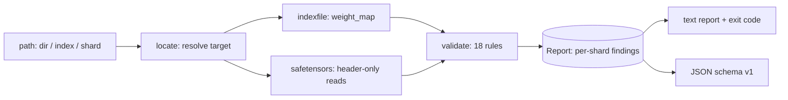

# shardcheck

[English](README.md) | [中文](README.zh.md) | [日本語](README.ja.md)

[](LICENSE) [](CHANGELOG.md) [](pyproject.toml)  [](CONTRIBUTING.md)

**开源的分片 checkpoint 索引预检工具 —— 跨 safetensors 分片的缺失、重复、截断、区间重叠张量，几秒内查出，而不是等加载几分钟后才崩。**


```bash
git clone https://github.com/JaydenCJ/shardcheck && cd shardcheck && pip install -e .
```

> **预发布：** shardcheck 尚未发布到 PyPI。首个正式版之前，请克隆 [JaydenCJ/shardcheck](https://github.com/JaydenCJ/shardcheck) 并在仓库根目录执行 `pip install -e .`。

## 为什么选 shardcheck？

一个分片 checkpoint 本质上是 `model.safetensors.index.json` 与几十个分片文件之间的一份契约 —— 而在加载之前没有任何东西强制校验它。上传到一半断掉的分片、重新分片后遗留的过期索引、上一次保存残留的多余文件：这些问题都会"正常"加载好几分钟，然后在 loader 深处、在 GPU 机器上、在权重已经全部拉下来之后，以一个 `KeyError` 或尺寸断言崩掉。`transformers` 只能靠真正执行加载才发现损坏；`safetensors` 库只在打开单个文件时校验，对索引一无所知。shardcheck 只读 header —— 每个分片几 KB，从不读张量数据 —— 在一秒之内交叉核对整份契约，输出按分片分组的结论和可直接接入 CI 的稳定规则 id。

|  | shardcheck | transformers 加载 | safetensors（打开） | 手写脚本 |
|---|---|---|---|---|
| 错误何时暴露 | 加载任何东西之前 | 加载几分钟后 | 逐文件、打开时 | 取决于上次维护时间 |
| 索引 ↔ 分片交叉核对（缺失 / 张量在错误分片 / 重复 / 未映射） | 是 | 部分，表现为很晚的崩溃 | 否 | 很少 |
| 检出半上传的分片，并给出精确缺失字节数 | 是 | 崩溃但没有字节数 | 是，但一次一个文件 | 通常只比文件大小 |
| 按分片分组的报告 + 稳定规则 id + CI 退出码 | 是 | 否（只有一个异常） | 否 | 临时拼凑 |
| 是否读张量数据 | 从不 —— 只读 header | 是，全部读取 | 打开时 mmap | 看情况 |
| 运行时依赖 | 0 | torch + 一整棵依赖树 | 1 个原生 wheel | 随时间增长 |

<sub>各行结论基于 2026-07 时 transformers 4.x `from_pretrained` 与 safetensors 0.4–0.5 `safe_open` 的行为。shardcheck 的依赖数即 [pyproject.toml](pyproject.toml) 中的 `dependencies = []`。</sub>

## 特性

- **五秒预检** —— 每个分片只读 `8 + header_size` 字节，100 GB 的 checkpoint 也能在一秒内查完；每次上传、下载、重新分片之后都值得跑一遍。
- **半上传克星** —— `shard-truncated` 把文件实际大小与 header 承诺的大小对比，精确报告尾部缺了多少字节。
- **过期索引取证** —— 孤儿分片同样会被解析：索引映射到分片 A、实际却躺在未被引用的分片 B 里的张量，会被报成指向 B 的 `wrong-shard`，而不是一句含糊的"缺失"。
- **18 条规则，id 稳定** —— 三个层次（索引交叉核对、分片容器、payload 布局），文档见 [`docs/rules.md`](docs/rules.md) 和 `shardcheck explain`；id 的含义永不改变。
- **有信号，无噪音** —— 分片缺失只报一条，而不是每个映射到它的张量各报一条；总大小只在能算出完整和时才比较；零长度张量不会触发布局规则。
- **CI 原生** —— 退出码 0/1/2、`--strict` 把警告也变成失败、带版本号 schema 的 `--json`，还有字节级检测 header 内重复键 —— 所有 JSON 解析器都会悄悄吞掉的那种损坏。

## 快速上手

安装：

```bash
git clone https://github.com/JaydenCJ/shardcheck && cd shardcheck && pip install -e .
```

指向一个 checkpoint 目录、一个 `*.index.json`，或单个分片文件：

```bash
shardcheck check checkpoints/my-model
```

真实抓取的输出（一个带半上传分片和过期索引的 checkpoint；由 `examples/make_fixture.py` 构建）：

```text
shardcheck: checkpoints/my-model
mode: index   3 shards   7 tensors

model-00002-of-00002.safetensors
  error   shard-truncated      file is 6,520 bytes but header + tensor data need 10,616 (4,096 bytes missing from the tail — half-uploaded?)
  error   duplicate-tensor     'lm_head.weight' is defined in 2 shards: model-00002-of-00002.safetensors, model-00003-of-00003.safetensors
  error   missing-tensor       'model.layers.2.attn.weight' is mapped here but no shard on disk defines it

model-00003-of-00003.safetensors
  warning orphan-shard         present next to the index but never referenced by weight_map

model-00001-of-00002.safetensors
  error   wrong-shard          'model.norm.weight' is mapped here but actually lives in model-00002-of-00002.safetensors

FAIL: 4 errors, 1 warning in 3 of 3 shards
```

退出码为 1，发布流水线到这里就会停下。健康的 checkpoint 以 0 退出，结论只有一行：

```text
OK: 2 shards, 6 tensors, no findings
```

逐分片查看大小（注意被截断的文件和孤儿分片）：

```bash
shardcheck ls checkpoints/my-model
```

```text
shard                             tensors  tensor bytes  file bytes  status
model-00001-of-00002.safetensors  3        14,336        14,608      referenced
model-00002-of-00002.safetensors  3        10,368        6,520       referenced
model-00003-of-00003.safetensors  1        8,192         8,280       orphan
```

同样的检查在 Python 里只需一个 import：

```python
from shardcheck import validate

report = validate("checkpoints/my-model")
assert report.ok, [f.rule for f in report.findings]
```

## 命令与退出码

| 命令 | 作用 | 退出码 |
|---|---|---|
| `shardcheck check PATH [--json] [--strict] [-v]` | 对索引文件、分片或目录运行全部 18 条规则 | 0 可加载 / 1 有发现 / 2 目标不可用 |
| `shardcheck ls PATH [--json]` | 每个分片一行：张量数、声明字节数、文件字节数、状态 | 0 / 2 |
| `shardcheck explain [RULE]` | 规则总目录，或单条规则的完整文档 | 0 / 2 |

完整规则参考 —— 全部 18 个 id、严重级别、触发条件和 JSON schema —— 见 [`docs/rules.md`](docs/rules.md)。

## 验证

本仓库不带 CI；上述所有结论均由本地运行验证。在本仓库的检出中即可复现：

```bash
pip install -e '.[dev]' && pytest && bash scripts/smoke.sh
```

输出（摘自一次真实运行，用 `...` 截断）：

```text
90 passed in 0.27s
...
[ls] model-00003-of-00003.safetensors  1        8,192         8,280       orphan
SMOKE OK
```

## 架构



## 路线图

- [x] 只读 header 的解析器、18 条规则的校验器、按分片分组的报告、`check`/`ls`/`explain`、JSON schema、Python API（v0.1.0）
- [ ] 发布到 PyPI，支持 `pip install shardcheck`
- [ ] `--fix` 模式：根据磁盘上的分片重新生成正确的索引
- [ ] 可选深度校验：按 lockfile 对张量 payload 做哈希比对
- [ ] 支持 GGUF 与 PyTorch-bin 索引，覆盖混合格式仓库

完整列表见 [open issues](https://github.com/JaydenCJ/shardcheck/issues)。

## 贡献

欢迎贡献 —— 可以从一个 [good first issue](https://github.com/JaydenCJ/shardcheck/issues?q=is%3Aissue+is%3Aopen+label%3A%22good+first+issue%22) 入手，或发起一个 [discussion](https://github.com/JaydenCJ/shardcheck/discussions)。开发环境搭建见 [CONTRIBUTING.md](CONTRIBUTING.md)。

## 许可证

[MIT](LICENSE)
